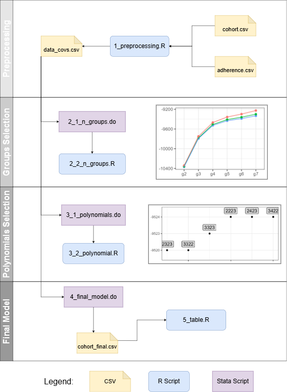

# Psoriasis Biologics Adherence

Analysis code for the study “Trajectories and determinants of adherence to biologics in psoriasis: Evidence from the administrative data source of the Tuscany region”, investigating adherence trajectories and determinants among patients with psoriasis treated with biologics in Tuscany, Italy.

## Script Structure

